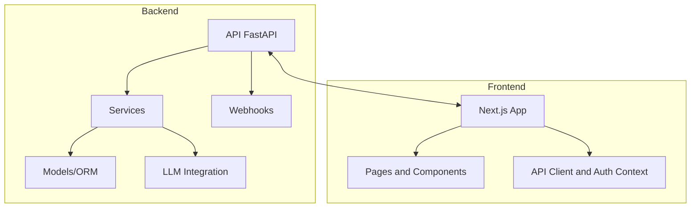
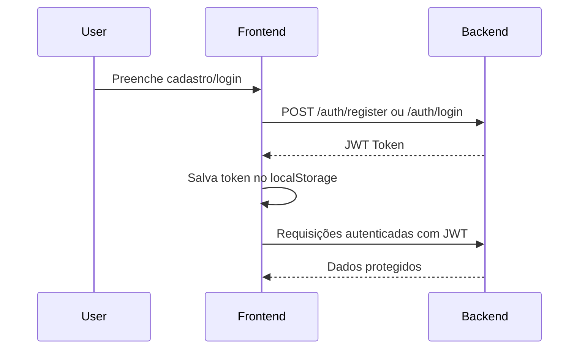

# Arquitetura e Contexto do Gestor de Leads do WhatsApp

## 1. Visão Geral

- **Propósito:** Micro SaaS para triagem e gestão de leads via WhatsApp, usando LLM para classificar leads, gerar resumos e sugerir respostas, focando vendedores nas melhores oportunidades.
- **Stack:**
  - **Backend:** Python 3.11+, FastAPI, SQLAlchemy async, PostgreSQL, LiteLLM
  - **Frontend:** Next.js 16, React 19, Tailwind CSS, shadcn/ui, next-themes
  - **Infra:** Docker Compose

## 2. Estrutura de Pastas

```text
app/
    core/              # Configuração, database, segurança
    models/            # Modelos ORM (Tenant, User, Lead, Message, Analysis, WhatsAppSession)
    providers/         # Contratos/factory/adapters de integrações externas (WhatsApp, etc.)
    routers/           # Rotas FastAPI (auth, tenants, webhooks, analysis, dashboard)
    schemas/           # Schemas Pydantic (validação e resposta)
    services/          # Lógica de negócio (análise, auth, webhooks, funil)
frontend/
    src/app/           # Páginas Next.js (dashboard, leads, onboarding, settings, login, register)
    src/components/    # Componentes de aplicação e UI
    src/components/ui/ # Base visual shadcn/ui + componentes customizados do design system
    src/lib/           # API client, contextos, utilitários
    tests/             # Scripts utilitários de seed/validação manual
tests/                 # Testes backend unitários e integração (pytest)
.github/
    AGENTS.md          # Guia de comportamento dos agentes
    copilot-instructions.md
    memories/          # Decisões, padrões, troubleshooting, planos de execução
    rfcs/              # Mudanças formais e padrões arquiteturais
    skills/            # Skills por domínio
.prompts/
    frontend.md
    redesign-frontend/
```

## 3. Backend

### 3.1 Modelos Principais

- **Tenant:** Empresa/usuário, com configuração de funil.
- **User:** Usuário autenticado, vinculado a um tenant.
- **WhatsAppSession:** Sessão de conexão com WhatsApp.
- **Lead:** Lead captado, com status, etapa, score, lock de processamento.
- **Message:** Mensagens trocadas com o lead.
- **Analysis:** Resultado da análise da LLM (score, etapa, resumo, dicas, sugestão de resposta).

### 3.2 Rotas e Serviços

- **Auth:** Registro, login, JWT, multi-tenant.
- **Tenants:** CRUD e configuração de funil dinâmico.
- **Webhooks:** Recebe eventos do WhatsApp, cria leads e armazena mensagens.
- **WhatsApp Session:**
    - `/whatsapp/connect`: inicia/recupera sessão WAHA do tenant.
    - `/whatsapp/qrcode`: retorna QR code atual para conexão.
    - `/whatsapp/status`: sincroniza e retorna estado da sessão.
    - `WhatsAppSessionService`: orchestration agnóstico a provider.
    - `app/providers/whatsapp/`: contrato (`interface.py`), factory (`factory.py`) e adapter WAHA (`waha.py`).
- **Analysis:**
  - `/leads/{id}/analyze`: análise individual de lead com lock otimista, chamada LLM, parsing e persistência.
  - `/leads/analyze-all`: análise em lote com controle de concorrência.
  - **Watchdog:** tarefa background para resetar locks travados.
- **Dashboard:** listagem, filtros, estatísticas e detalhamento de leads.

### 3.3 Concorrência e Locks

- **is_processing:** coluna booleana no Lead para evitar double submit.
- **Watchdog:** reseta locks travados há mais de 5 minutos.
- **Validação:** respostas da LLM validadas via Pydantic.

## 4. Frontend

### 4.1 Páginas Principais

- **Dashboard:** KPIs, priorização visual de leads e padrão `Sliding Master-Detail` para lista + detalhe.
- **Leads:** lista detalhada, análise individual/lote, alteração de status e filtros segmentados.
- **Lead Detail:** detalhe do lead, histórico de mensagens, análises da LLM e alteração manual de etapa/status.
- **Onboarding:** seleção de template de funil e configuração inicial.
- **Settings:** edição do funil e aplicação de templates.
- **Auth Pages:** login, cadastro e redirecionamento inicial com tratamento de hidratação.

### 4.2 Design System e Componentes UI

- Base visual derivada de shadcn/ui com redesign formalizado em [RFC 002](rfcs/002-frontend-redesign.md).
- Componentes-base atualizados: `button`, `card`, `input`, `table`, `select`, `dialog`.
- Componentes customizados relevantes:
  - `temperature-badge.tsx`
  - `segmented-tabs.tsx`
  - `preloader.tsx`
  - `AppWithPreloader.tsx`
- Tema com `next-themes`, suporte a light/dark e tokens globais em `frontend/src/app/globals.css`.

### 4.3 API Client

- `frontend/src/lib/api.ts` centraliza autenticação, CRUD de leads, análise, configuração de funil e utilitários de request.
- Usa JWT salvo no `localStorage`.
- `frontend/src/lib/auth-context.tsx` faz bootstrap client-side do token e resolve o estado autenticado.

### 4.4 Validação Atual de Frontend

- Não existe suíte E2E automatizada ativa no frontend neste momento.
- `frontend/tests/` contém scripts utilitários para seed e validação manual.
- Validação obrigatória de frontend:
  - execução via Docker Compose
  - navegação no Integrated Browser do VS Code
  - inspeção de logs com `docker compose logs -f frontend`
  - checagem técnica com lint e type-check

## 5. Convenções para IA

- **Leia primeiro:** `.github/AGENTS.md`, `.github/copilot-instructions.md`, este arquivo e as RFCs relevantes.
- **Frontend:** seguir [RFC 002](rfcs/002-frontend-redesign.md) para decisões visuais e de validação.
- **Skills:** carregar skills relevantes de `.github/skills/` conforme o domínio.
- **Memória:** usar `.github/memories/` para registrar decisões, padrões, troubleshooting e planos.
- **Planos de execução:** consultar `.github/memories/exec-plans/PLAN-INDEX.md`.
- **Documentação:** atualizar RFCs, arquitetura e memórias quando o comportamento real do sistema mudar.

## 6. Fluxos Críticos

- **Onboarding:** cadastro → seleção de template de funil → início da operação.
- **Ingestão:** webhook recebe mensagem → cria lead se novo → armazena mensagem.
- **Integração WhatsApp (WAHA):** usuário inicia conexão → backend cria sessão WAHA → frontend busca QR code → WAHA envia eventos via webhook → backend valida HMAC e persiste mensagens.
- **Seleção de Provider:** backend resolve provider via `WHATSAPP_PROVIDER` na factory, sem alterar endpoints públicos.
- **Análise:** botão de análise → lock otimista → chamada LLM → parsing → persistência → unlock.
- **Dashboard:** exibe leads priorizados, agrupamento visual por contexto comercial e KPIs.
- **Gestão Manual:** usuário pode alterar etapa/status manualmente, sobrescrevendo inferência da IA.
- **Autenticação Frontend:** token em `localStorage` → `auth-context` resolve sessão → layout autenticado protege rotas.

## 7. Diagramas

### Diagrama de Módulos



### Fluxo de Autenticação



### Relacionamento de Entidades

```mermaid
erDiagram
    TENANT ||--o{ USER : possui
    TENANT ||--o{ LEAD : possui
    LEAD ||--o{ MESSAGE : possui
    LEAD ||--o{ ANALYSIS : possui
    TENANT ||--o{ WHATSAPP_SESSION : possui
    USER }o--|| TENANT : pertence

### Integração WhatsApp (QR + Webhook)

```mermaid
sequenceDiagram
    participant U as Usuario
    participant FE as Frontend
    participant BE as Backend
    participant PF as Provider Factory
    participant WAHA as WAHA API

    U->>FE: Clicar em conectar WhatsApp
    FE->>BE: POST /whatsapp/connect
    BE->>PF: Resolve provider (WHATSAPP_PROVIDER)
    PF-->>BE: Adapter WhatsApp
    BE->>WAHA: POST /api/sessions
    WAHA-->>BE: session_id/status
    FE->>BE: GET /whatsapp/qrcode
    BE->>WAHA: GET /api/{session}/auth/qr
    WAHA-->>BE: qrCode
    BE-->>FE: qr_code
    WAHA->>BE: POST /webhooks/whatsapp (event message)
    BE->>BE: valida HMAC + session_id + tenant
    BE->>BE: persiste Lead/Message
```

Estados de sessão mapeados no backend:
- `PENDING`
- `QR_CODE_READY`
- `CONNECTING`
- `CONNECTED`
- `DISCONNECTED`
- `ERROR`

Observação de infraestrutura:
- WAHA CORE suporta somente sessão `default` (sessão única).
- Para isolamento real de 1 sessão por tenant em produção, é necessário WAHA PLUS ou isolamento por instância.
```

## 8. RFCs

- [001 - Padrão de Serviços](rfcs/001-padrao-servicos.md)
- [002 - Frontend Redesign](rfcs/002-frontend-redesign.md)

## 9. Referências Rápidas

- `.github/AGENTS.md`
- `.github/copilot-instructions.md`
- `.github/memories/exec-plans/PLAN-INDEX.md`
- `.github/rfcs/`
- `.github/skills/`
- `.prompts/frontend.md`
- `.prompts/redesign-frontend/`

## 10. Atualização Obrigatória

- Atualize este arquivo ao alterar estrutura, fluxos, dependências, protocolo de validação ou RFCs vigentes.
- Sempre revise as RFCs relacionadas ao propor mudanças estruturais ou visuais significativas.
