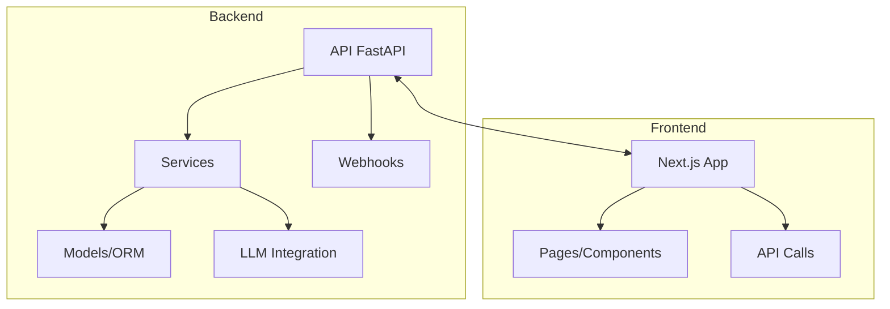
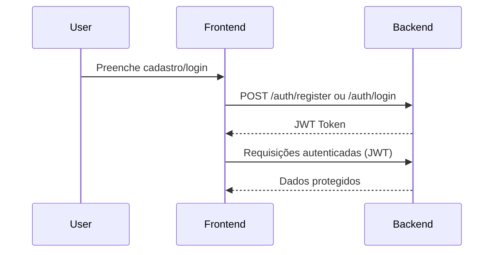
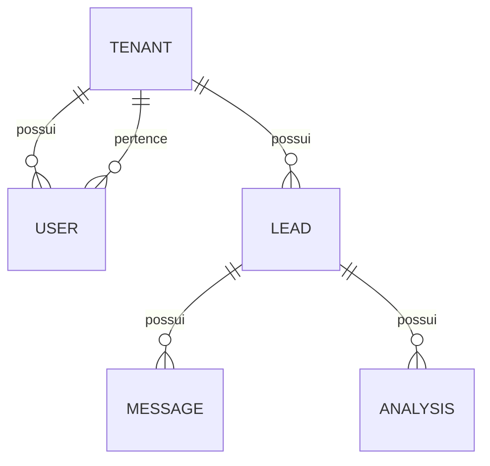

# Arquitetura e Contexto do Gestor de Leads do WhatsApp

## 1. Visão Geral

- **Propósito:** Micro SaaS para triagem e gestão de leads via WhatsApp, usando LLM para classificar leads, gerar resumos e sugerir respostas, focando vendedores nas melhores oportunidades.
- **Stack:** 
    - **Backend:** Python 3.14, FastAPI, SQLAlchemy (async), PostgreSQL, LiteLLM
    - **Frontend:** Next.js 16, React, Tailwind CSS, shadcn/ui
    - **Infra:** Docker Compose

---

## 2. Estrutura de Pastas

```
app/
    core/         # Configuração, database, segurança
    models/       # Modelos ORM (Tenant, User, Lead, Message, Analysis, WhatsAppSession)
    routers/      # Rotas FastAPI (auth, tenants, webhooks, analysis, dashboard)
    schemas/      # Schemas Pydantic (validação e resposta)
    services/     # Lógica de negócio (análise, auth, webhooks, funil)
frontend/
    src/app/      # Páginas Next.js (dashboard, leads, onboarding, settings)
    src/components/ui/ # Componentes visuais (badge, button, card, etc)
    src/lib/      # API client, contextos, utilitários
tests/            # Testes unitários e integração (pytest)
.github/
    instructions/ # Instruções para agentes IA
    memories/     # Decisões, padrões, troubleshooting
    rfcs/         # Propostas formais de mudanças e padrões de arquitetura 
    skills/       # Skills por domínio (ex: analysis, frontend, auth)
.prompts/         # PRD, plano, progresso, frontend
```

---

## 3. Backend

### 3.1 Modelos Principais (`app/models/models.py`)

- **Tenant:** Empresa/usuário, com configuração de funil.
- **User:** Usuário autenticado, vinculado a um tenant.
- **WhatsAppSession:** Sessão de conexão com WhatsApp.
- **Lead:** Lead captado, com status, etapa, score, lock de processamento.
- **Message:** Mensagens trocadas com o lead.
- **Analysis:** Resultado da análise da LLM (score, etapa, resumo, dicas, sugestão de resposta).

### 3.2 Rotas e Serviços

- **Auth:** Registro, login, JWT, multi-tenant.
- **Tenants:** CRUD e configuração de funil dinâmico.
- **Webhooks:** Recebe eventos do WhatsApp (message.upsert), cria leads, armazena mensagens.
- **Analysis:** 
    - `/leads/{id}/analyze`: Análise individual de lead (lock otimista, chamada LLM, parsing, persistência).
    - `/leads/analyze-all`: Análise em lote (semáforo para concorrência).
    - Watchdog: Tarefa background para resetar locks travados.
- **Dashboard:** Listagem, filtros, estatísticas, detalhamento de leads.

### 3.3 Concorrência e Locks

- **is_processing:** Coluna booleana no Lead para evitar double-submit.
- **Watchdog:** Reseta locks travados há mais de 5 minutos.
- **Validação:** Respostas da LLM validadas via Pydantic.

---

## 4. Frontend

### 4.1 Páginas Principais

- **Dashboard:** Visualização de leads por etapa do funil, badges de temperatura, estatísticas.
- **Leads:** Lista detalhada, análise individual/lote, alteração de status, visualização de etapas.
- **Lead Detail:** Detalhe do lead, histórico de mensagens, análises da LLM, alteração manual de etapa/status.
- **Onboarding:** Seleção de template de funil, configuração inicial.
- **Settings:** Edição do funil, aplicação de templates.

### 4.2 Componentes UI

- **Badge, Button, Card, Table, Dialog, Select, etc:** Baseados em shadcn/ui, com classes Tailwind para responsividade e dark mode.

### 4.3 API Client (`src/lib/api.ts`)

- Funções para autenticação, CRUD de leads, análise, configuração de funil, etc.
- Usa token JWT salvo no localStorage.

---

## 5. Convenções e Skills para IA

- **Leia sempre:** `.prompts/prd.md`, `.prompts/plano.md`, `.prompts/progresso.md` antes de iniciar tarefas.
- **Skills:** Carregue skills relevantes de `.github/skills/` conforme o domínio (ex: analysis, frontend, auth).
- **Memória:** Use `memories/` para registrar decisões, padrões, troubleshooting.
- **Testes:** Use pytest, siga TDD, rode todos os testes após mudanças.
- **Frontend:** Valide endpoints via curl após alterações.
- **Documentação:** Atualize README e progresso após cada entrega.

---

## 6. Fluxos Críticos

- **Onboarding:** Cadastro → seleção de template de funil → conexão WhatsApp (QR Code).
- **Ingestão:** Webhook recebe mensagem → cria lead se novo → armazena mensagem.
- **Análise:** Botão "Atualizar Análise" → lock otimista → chamada LLM → parsing → persistência → unlock.
- **Dashboard:** Exibe leads agrupados por etapa, badges de temperatura, estatísticas em tempo real.
- **Gestão Manual:** Usuário pode alterar etapa/status manualmente, sobrescrevendo inferência da IA.

---

## 7. Referências Rápidas

- **PRD:** `.prompts/prd.md`
- **Plano:** `.prompts/plano.md`
- **Progresso:** `.prompts/progresso.md`
- **Instruções para IA:** `.github/instructions/copilot-instructions.md`
- **Skills:** `.github/skills/`
- **Memórias:** `memories/`

---

> **Dica:** Para desenvolvimento assistido por IA, mantenha este arquivo sempre atualizado e referencie-o em instruções, skills e memórias. Isso garante contexto consistente e evita retrabalho.
# Arquitetura do Projeto

## Diagramas
- [Diagrama de Módulos](#diagrama-de-módulos)
- [Fluxo de Autenticação](#fluxo-de-autenticacao)
- [Relacionamento de Entidades](#relacionamento-de-entidades)

## RFCs
- [001 - Padrão de Serviços](rfcs/001-padrao-servicos.md)

## Dependências
- Python 3.11+, FastAPI, SQLAlchemy[asyncio], Alembic, litellm, Next.js, Tailwind CSS, shadcn/ui, Docker, pytest, etc.

---

## Diagrama de Módulos



## Fluxo de Autenticação



## Relacionamento de Entidades



---

## RFCs
- [001 - Padrão de Serviços](rfcs/001-padrao-servicos.md)

---

## Atualização obrigatória
- Atualize este arquivo ao alterar estrutura, fluxos, dependências ou criar novos diagramas/RFCs.
