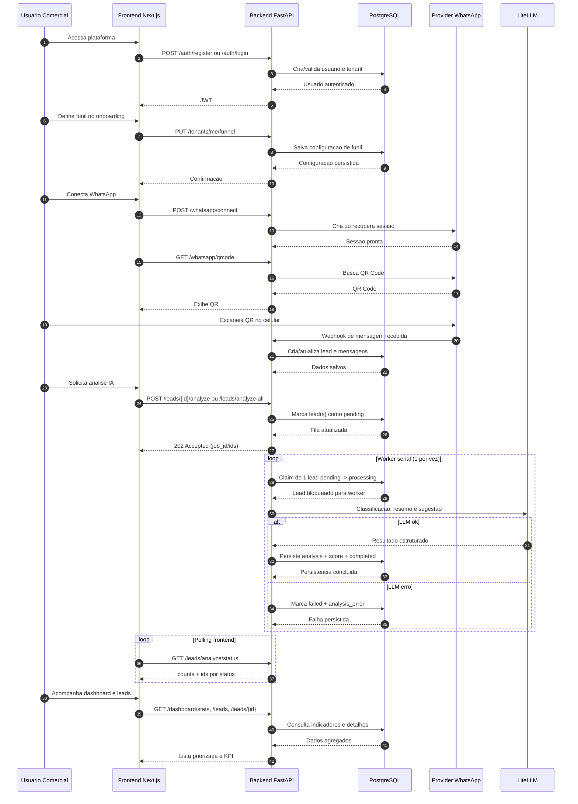
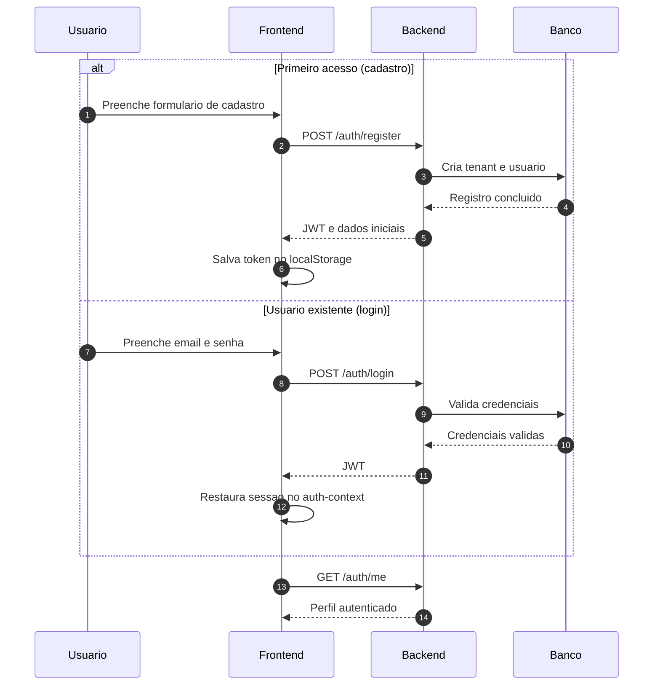
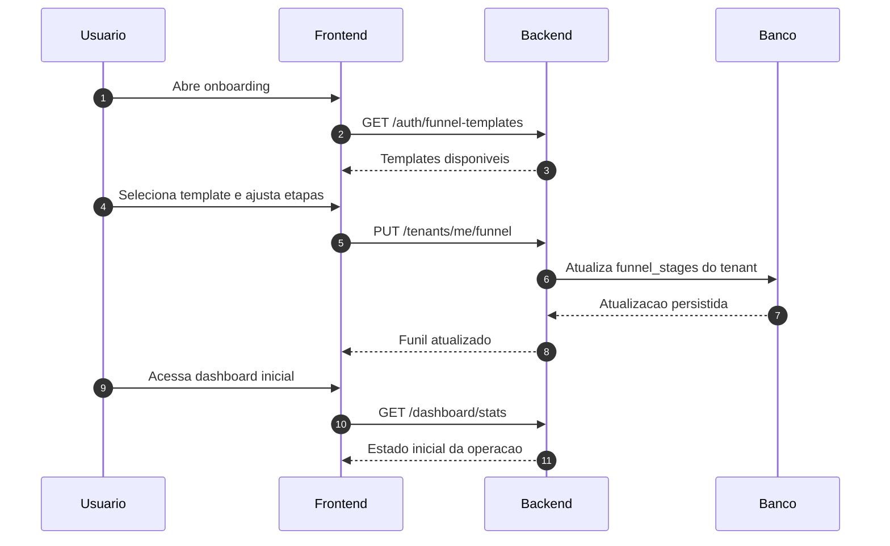
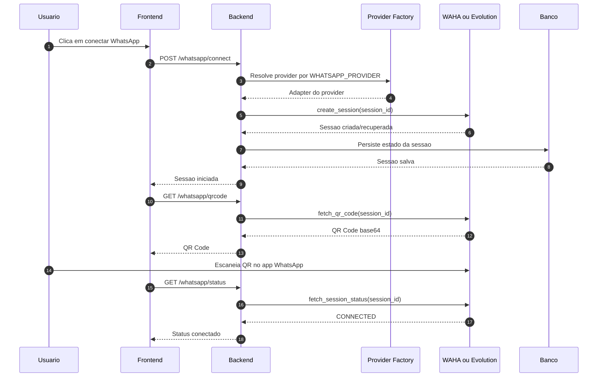
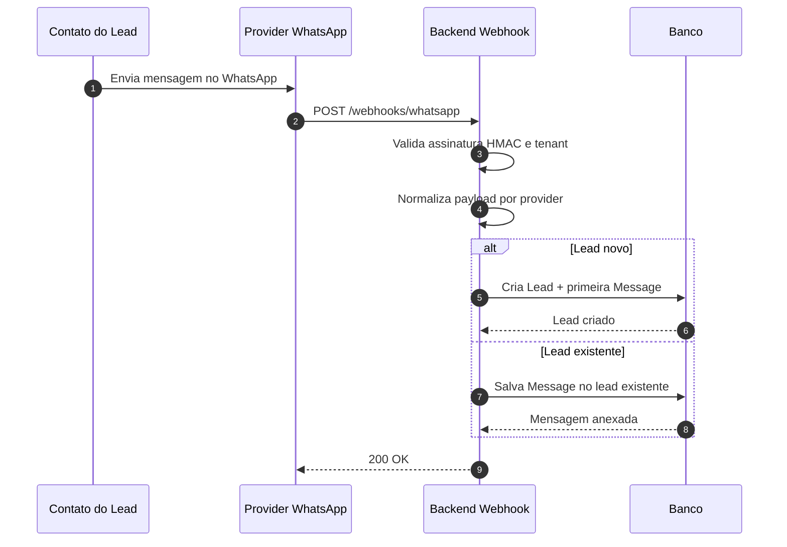
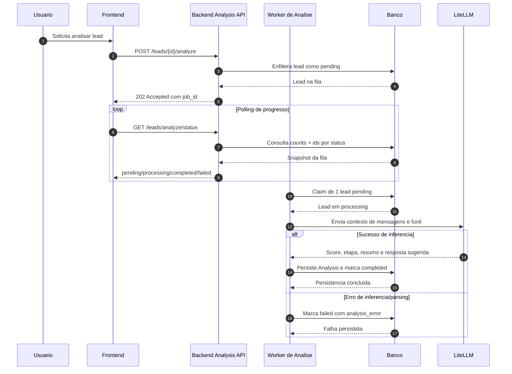
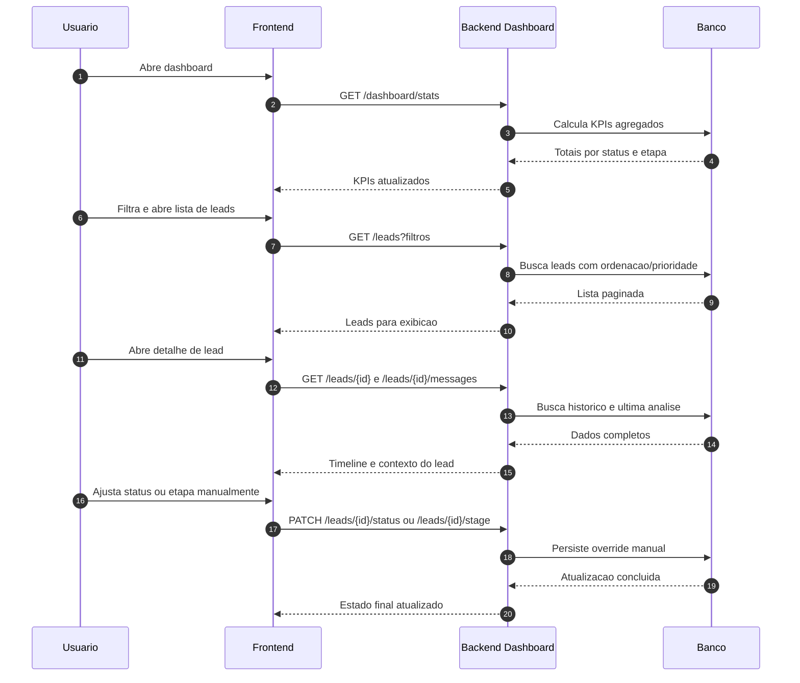
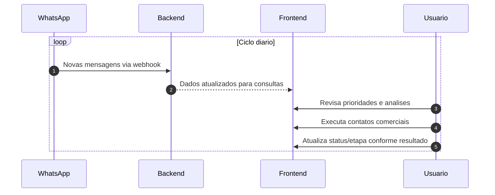

# Jornada do Cliente na Aplicacao

Este documento descreve, com diagramas de sequencia Mermaid, a jornada completa do cliente (time comercial) usando o Gestor de Leads do WhatsApp.

## 1. Visao Geral Ponta a Ponta

## 2. Cadastro e Login

## 3. Onboarding e Configuracao de Funil

## 4. Conexao WhatsApp (QR Code)

## 5. Ingestao de Mensagens e Criacao de Leads

## 6. Analise de Leads com IA

## 7. Operacao Diaria: Dashboard e Gestao Manual

## 8. Loop Continuo da Operacao Comercial

## Observacoes

- Os diagramas representam os fluxos principais da arquitetura atual e os endpoints publicos existentes.
- A selecao do provider WhatsApp e transparente para o frontend, ficando encapsulada no backend.
- A jornada combina automacao (webhooks e IA) com governanca humana (ajustes manuais de status e etapa).
