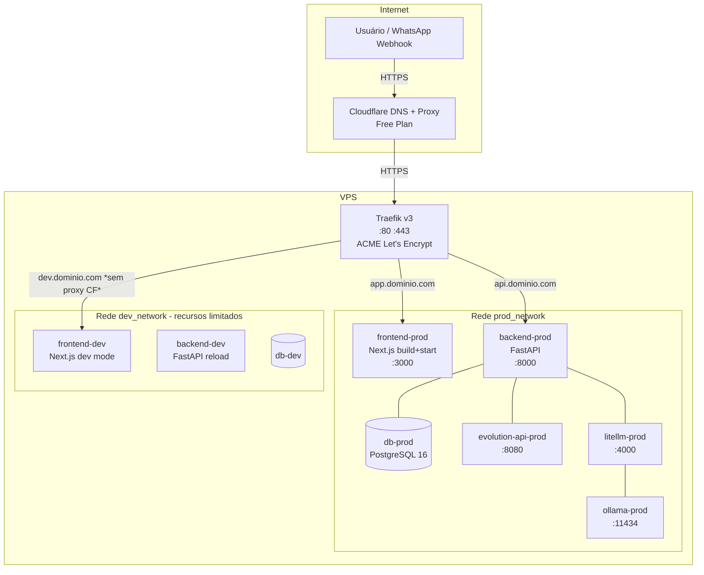

# Plano de Implementação: Deploy em Produção na VPS

**Objetivo:** Colocar o app em produção na mesma VPS de desenvolvimento, separando ambientes por namespaces Docker, limitando recursos do dev, expondo prod via Traefik + Cloudflare.

---

## Contexto e Decisões Arquiteturais

### Cloudflare — Resumo de Custos

| Plano | Custo | O que inclui de relevante |
|---|---|---|
| **Free** | **R$ 0** | DNS, CDN/proxy, SSL automático, DDoS básico (L3/L4), 5 regras de firewall, Cloudflare Tunnel |
| Pro | ~$20/mês | WAF avançado, mais regras, analytics, rate limiting por rota |
| Business | ~$200/mês | SLA 100%, cache personalizado, bypass rules |

**Recomendação:** O plano **Free é suficiente** para o MVP em produção. Oferece:
- HTTPS automático (sem precisar gerenciar certificados manualmente)
- Proteção DDoS
- CDN com cache de assets estáticos
- Cloudflare Tunnel (opcional, evita expor IP da VPS diretamente)
- Rate limiting básico via Traefik no lado do servidor complementa o que o Free não tem

---

### Estratégia de Separação Dev / Prod na mesma VPS

```
VPS
├── Docker network: prod_network
│   └── Traefik (único, gerencia ambos os ambientes)
│   └── Stack prod: backend, frontend, db, evolution-api, litellm, ollama
│
├── Docker network: dev_network
│   └── Stack dev: backend, frontend, db, evolution-api, litellm, ollama
│   └── Recursos limitados via deploy.resources.limits
│
└── Cloudflare
    ├── app.seudominio.com → Traefik → prod
    └── dev.seudominio.com → Traefik → dev  (opcional, sem Cloudflare proxy ou com IP rules)
```

**Limites de recurso para dev** (evitar starvation de prod):
- CPU: max 1.5 cores (dev inteiro)
- RAM: max 3GB (dev inteiro) — ajustar conforme RAM total da VPS

---

## Fases e Tarefas

### Fase 1 — Preparação da Infraestrutura

- [ ] **1.1** Auditar recursos da VPS: CPU, RAM, disco disponível (`free -h`, `df -h`, `nproc`)
- [ ] **1.2** Definir domínio e subdomínios (`app.`, `api.`, `dev.`)
- [ ] **1.3** Criar conta Cloudflare (Free), adicionar domínio e configurar DNS (modo proxied)
- [ ] **1.4** Instalar Traefik v3 como serviço dedicado (arquivo `docker-compose.traefik.yml` separado)
- [ ] **1.5** Configurar Traefik com Let's Encrypt via DNS challenge do Cloudflare (wildcard cert)

### Fase 2 — Compose de Produção

- [ ] **2.1** Criar `docker-compose.prod.yml` com:
  - Variáveis de ambiente lidas de `.env.prod` (nunca commitado)
  - Frontend rodando `npm run build && npm start` (modo produção, não `dev`)
  - `restart: unless-stopped` em todos os serviços críticos
  - Labels Traefik em cada serviço (roteamento por host)
  - Volumes nomeados separados dos volumes de dev (`pgdata_prod`, etc.)
  - Rede `prod_network` isolada
- [ ] **2.2** Criar `.env.prod.example` documentando todas as variáveis de prod
- [ ] **2.3** Configurar `NEXT_PUBLIC_API_URL` apontando para o domínio público de prod

### Fase 3 — Limites de Recurso no Dev

- [ ] **3.1** Adicionar `deploy.resources.limits` no `docker-compose.yml` (dev) para cada serviço:
  - `ollama`: 1 CPU, 2GB RAM (maior consumidor)
  - `litellm`: 0.5 CPU, 512MB RAM
  - `backend`: 0.5 CPU, 512MB RAM
  - `frontend` (dev mode): 0.5 CPU, 1GB RAM
  - `evolution-api`: 0.3 CPU, 256MB RAM
  - `db` (dev): 0.3 CPU, 256MB RAM
- [ ] **3.2** Validar que dev ainda sobe corretamente após os limites

### Fase 4 — Traefik: Configuração Detalhada

- [ ] **4.1** Criar `infra/traefik/traefik.yml` (configuração estática):
  - entrypoints HTTP (80) e HTTPS (443)
  - ACME Let's Encrypt com DNS challenge Cloudflare
  - Dashboard protegido por basicauth (acessível só em IP interno ou com segredo)
- [ ] **4.2** Criar `infra/traefik/dynamic/` para configurações dinâmicas adicionais (middlewares globais: headers de segurança, rate limit)
- [ ] **4.3** Adicionar middleware de segurança padrão:
  - HSTS
  - X-Frame-Options
  - X-Content-Type-Options
  - Redirect HTTP → HTTPS automático
- [ ] **4.4** Validar roteamento: `app.dominio.com` → frontend prod, `api.dominio.com` → backend prod

### Fase 5 — Cloudflare: Configuração Final

- [ ] **5.1** Configurar registros DNS:
  - `A app.dominio.com → IP_VPS` (proxied ✓)
  - `A api.dominio.com → IP_VPS` (proxied ✓)
  - `A dev.dominio.com → IP_VPS` (DNS only, sem proxy — dev não precisa de CF na frente)
- [ ] **5.2** Configurar SSL mode: **Full (Strict)** no Cloudflare (Traefik gerencia cert válido via ACME)
- [ ] **5.3** Configurar Page Rules ou Cache Rules para assets estáticos do frontend (`/_next/static/*`)
- [ ] **5.4** Ativar regras básicas de segurança: bloquear bots maliciosos conhecidos, habilitar Bot Fight Mode (Free)
- [ ] **5.5** (Opcional) Configurar Cloudflare Tunnel como alternativa ao IP exposto diretamente

### Fase 6 — Secrets e Segurança de Prod

- [ ] **6.1** Garantir que `.env.prod` está no `.gitignore`
- [ ] **6.2** Criar senhas fortes para DB prod (`postgres` não pode ser senha de prod)
- [ ] **6.3** Configurar `SECRET_KEY` único para prod (JWT)
- [ ] **6.4** Revisar CORS no backend: aceitar apenas os domínios de prod
- [ ] **6.5** Configurar `DEBUG=false` e `LOG_JSON=true` em prod

### Fase 7 — Deploy Inicial e Validação

- [ ] **7.1** Subir stack prod: `docker compose -f docker-compose.prod.yml up -d`
- [ ] **7.2** Rodar migrações em prod: `docker compose -f docker-compose.prod.yml exec backend alembic upgrade head`
- [ ] **7.3** Criar tenant e usuário inicial em prod
- [ ] **7.4** Validar HTTPS end-to-end: frontend, API, webhook Evolution API
- [ ] **7.5** Testar recebimento de webhook real do WhatsApp via URL pública
- [ ] **7.6** Verificar headers de segurança (securityheaders.com)

### Fase 8 — Observabilidade Mínima

- [ ] **8.1** Configurar `docker compose logs --tail=200` como baseline de monitoramento
- [ ] **8.2** (Opcional) Adicionar healthcheck endpoint público (`/health`) e monitoramento externo gratuito (UptimeRobot ou BetterStack free tier)
- [ ] **8.3** Documentar runbook básico: como reiniciar serviço, ver logs, rodar migração em prod

---

## Diagrama de Topologia



---

## Dependências entre Fases

```
Fase 1 (Infra) → Fase 2 (Compose Prod) → Fase 4 (Traefik) → Fase 5 (Cloudflare) → Fase 7 (Deploy)
                                                                          ↑
                                      Fase 3 (Limites Dev) — independente, pode ser feita em paralelo
                                      Fase 6 (Secrets) — deve ser feita antes da Fase 7
```

---

## Notas e Riscos

- **Ollama em prod:** Considerar desabilitar Ollama em prod se a VPS tiver pouca RAM/VRAM e usar apenas LLM cloud (OpenAI). Atualizar `infra/litellm/config.yaml` para remover modelo local.
- **DB compartilhado vs separado:** O plano usa databases separados no mesmo container Postgres por ambiente (via `init-db.sh`), não containers separados, para economizar RAM. Avaliar se isso é aceitável.
- **Backups:** Não coberto neste plano — considerar plano dedicado de backup do volume `pgdata_prod`.
- **Cloudflare Tunnel:** Alternativa ao IP exposto; remove necessidade de abrir porta 443 no firewall da VPS diretamente. Usar `cloudflared` como serviço. Considerar se VPS tem IP fixo ou não.
