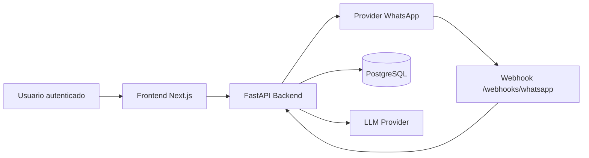

# Security Pending — WhatsApp Threat Model (2026-06-09)

Status: TRIAGED
Scope: Fase 6.8.1 (Threat modeling e escopo de risco)

## DFD (alto nível)

## Ativos sensíveis
- Telefone do lead (PII)
- Conteúdo de mensagens/conversas
- session_id de WhatsApp
- Tokens/segredos (`SECRET_KEY`, `WHATSAPP_API_KEY`, `WHATSAPP_WEBHOOK_HMAC_KEY`)
- Metadados de tenant (isolamento multi-tenant)

## Ameaças por severidade

### Alto
1. IDOR cross-tenant em `/whatsapp/qrcode` e `/whatsapp/status`
- Vetor: manipulação de identificadores para obter sessão de outro tenant.
- Mitigação aplicada: busca de sessão exclusivamente por `tenant_id` do contexto autenticado.

2. Replay/spoof de webhook
- Vetor: reenvio de payload válido ou assinatura falsa.
- Mitigação aplicada: HMAC + replay guard (timestamp/nonce/hash + TTL) + sessão conhecida.

3. Vazamento de PII em logs
- Vetor: logs com telefone/session_id/erros sensíveis.
- Mitigação aplicada: redaction central (`mask_identifier`, `sanitize_error_message`).

### Médio
1. Abuso por flood de endpoints sensíveis
- Mitigação: rate limiting em `/whatsapp/connect`, `/whatsapp/qrcode`, `/webhooks/whatsapp`, `/auth/login`.

2. Dependências vulneráveis (supply chain)
- Mitigação parcial: pip-audit limpo; npm high/critical removidos localmente com override.
- Pendência: fechamento de alerts high no Dependabot remoto.

### Baixo
1. Configuração fraca por ambiente (headers/CORS)
- Mitigação: headers de segurança configuráveis + CORS com métodos explícitos + documentação no README.

## Plano de mitigação por risco
- Alto/IDOR: testes negativos cross-tenant em endpoints WhatsApp.
- Alto/Replay: manter validação anti-replay e monitoramento de eventos recusados.
- Alto/PII: manter testes de não exposição e revisão contínua de logs.
- Médio/Supply chain: triagem contínua Dependabot até zero high aberto.

## Evidências associadas
- Testes de webhook/segurança e rate limiting no backend.
- Ajustes de redaction e headers de segurança.
- Registro de supply chain em `security/pending/2026-06-09-supply-chain-audit-findings.md`.
